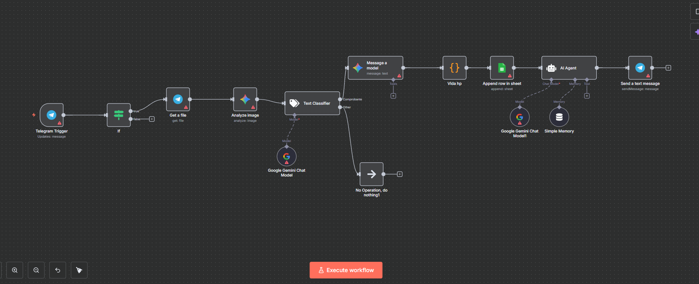

# Agente QR-TransactionAgent

Este agente automatiza el procesamiento de comprobantes de pago recibidos por **Telegram** y organiza la información de manera estructurada en **Google Sheets**, facilitando la gestión contable de los negocios.

---

## Flujo de trabajo

1. **Recepción en Telegram**
   - El agente se activa cuando un usuario envía una **imagen de un comprobante de transacción bancaria** (ejemplo: pagos por QR, transferencias, depósitos, etc.) a un bot de Telegram.

2. **Análisis de la imagen**
   - La imagen es procesada con **Google Gemini**, que extrae automáticamente los datos clave:
     - Tipo de operación  
     - Fecha y hora  
     - Monto y moneda  
     - Banco emisor y receptor  
     - Cuentas de origen y destino  
     - Titulares  
     - Número de referencia / folio  
     - Estado de la transacción  

3. **Clasificación**
   - Se valida que el archivo realmente corresponda a un **comprobante de pago** antes de procesarlo.

4. **Registro en Excel (Google Sheets)**
   - Los datos extraídos se guardan automáticamente en una hoja de cálculo de Google Sheets, con columnas como:
     - Fecha de registro  
     - Banco emisor y receptor  
     - Cuenta receptora  
     - Nombre cliente  
     - Número de transacción  
     - Estado de la transacción  
     - Fecha de transacción  
     - Monto de la transacción  
     - Descripción  

5. **Notificación automática**
   - El agente genera un **mensaje breve y profesional** para el dueño del negocio, confirmando que el comprobante fue procesado exitosamente.
   - El mensaje incluye los detalles más importantes (monto, fecha, bancos, referencia, etc.) y se envía al chat de Telegram.

---

## 🎯 Beneficios

- **Para negocios**: Automatiza el registro de transacciones y mejora el flujo de caja.  
- **Para contadores**: Reduce el trabajo manual de organizar comprobantes y evita errores humanos.  
- **Para dueños**: Hace más fácil llevar las cuentas al tener toda la información organizada en tiempo real.  

---
 
