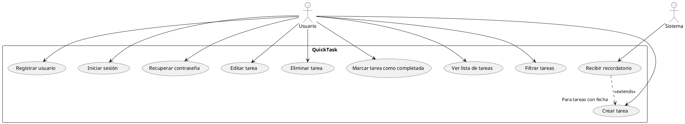
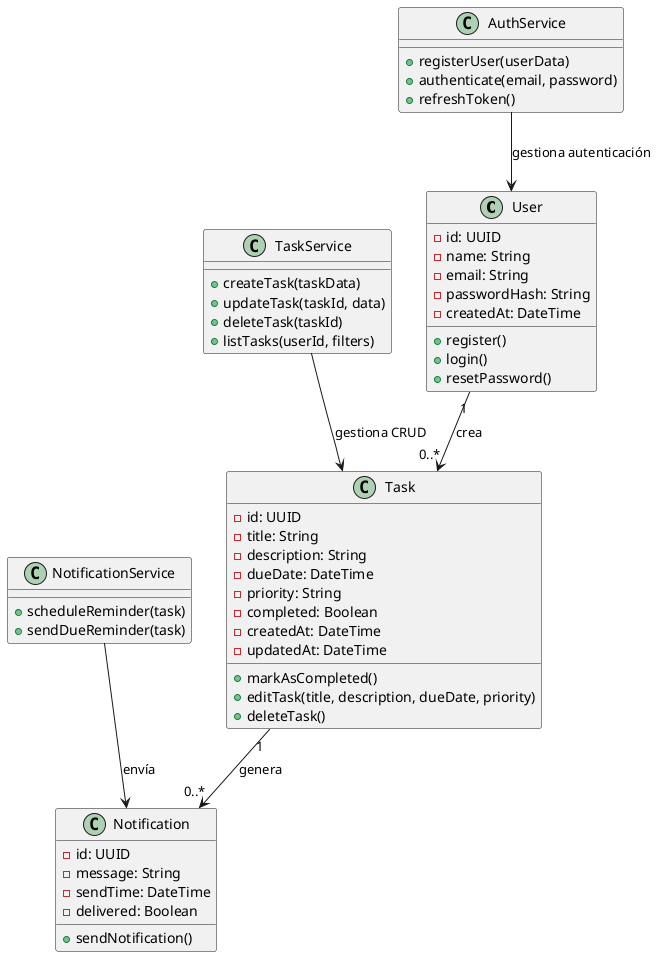
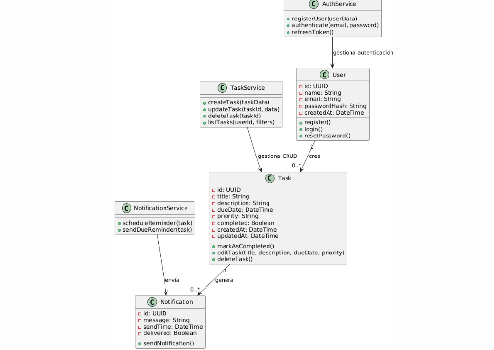
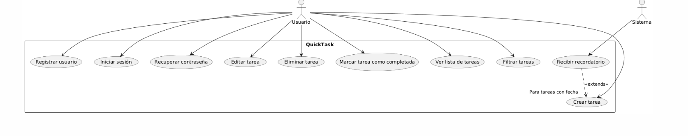

# Desarrollo de fases de la aplicación QuickTask mediante vibe coding

## **Levantamiento de requerimientos**

### **IA utilizada**:
* ChatGPT

### **Resultado**:

#### 📋 Especificación de Requerimientos — QuickTask

##### 1. Descripción general del sistema

**QuickTask** es una aplicación de gestión de tareas personales diseñada para ayudar a los usuarios a organizar y realizar un seguimiento de sus pendientes de manera simple, rápida e intuitiva.
Permite **crear, editar, eliminar, clasificar y marcar tareas como completadas**, además de ofrecer recordatorios y una vista general del progreso diario o semanal.

El sistema estará disponible como aplicación web (versión inicial), con posibilidad de expansión futura a dispositivos móviles.

---

##### 2. Actores principales

| Actor                 | Descripción                                                                                                                                 |
| --------------------- | ------------------------------------------------------------------------------------------------------------------------------------------- |
| **Usuario**           | Persona que utiliza la aplicación para gestionar sus tareas personales. Puede crear, editar, eliminar o marcar tareas como completadas.     |
| **Sistema QuickTask** | Software que almacena, procesa y muestra la información de las tareas, además de enviar recordatorios y actualizar el estado de las mismas. |

---

##### 3. Requerimientos funcionales

###### Creación y gestión de tareas

1. **RF-01:** El sistema debe permitir al usuario crear una nueva tarea con título y descripción.
2. **RF-02:** El usuario podrá asignar una fecha y hora de vencimiento a la tarea.
3. **RF-03:** El usuario podrá editar el título, descripción, prioridad o fecha de una tarea existente.
4. **RF-04:** El usuario podrá eliminar una tarea de su lista.
5. **RF-05:** El sistema deberá permitir marcar una tarea como completada o pendiente.
6. **RF-06:** El sistema deberá permitir clasificar tareas por prioridad (alta, media, baja).
7. **RF-07:** El sistema deberá mostrar las tareas ordenadas por fecha de vencimiento o prioridad.

###### Notificaciones y recordatorios

8. **RF-08:** El sistema debe permitir configurar recordatorios para tareas con fecha asignada.
9. **RF-09:** El sistema debe notificar al usuario cuando una tarea esté próxima a vencer (por ejemplo, 1 hora antes).

###### Visualización y filtrado

10. **RF-10:** El sistema debe permitir filtrar tareas por estado (pendientes o completadas).
11. **RF-11:** El usuario podrá visualizar un resumen del número de tareas completadas y pendientes.
12. **RF-12:** El sistema deberá mostrar un listado claro de tareas con información resumida (título, fecha, estado, prioridad).

###### Gestión de usuario

13. **RF-13:** El sistema debe permitir el registro de nuevos usuarios con correo electrónico y contraseña.
14. **RF-14:** El usuario podrá autenticarse para acceder a sus tareas personales.
15. **RF-15:** El sistema deberá permitir la recuperación de contraseña mediante correo electrónico.

---

##### 4. Requerimientos no funcionales

| Categoría          | Requerimiento                                                                                        |
| ------------------ | ---------------------------------------------------------------------------------------------------- |
| **Rendimiento**    | RNF-01: El sistema deberá mostrar la lista de tareas en menos de 2 segundos.                         |
| **Disponibilidad** | RNF-02: El sistema debe estar disponible al menos el 99% del tiempo mensual.                         |
| **Usabilidad**     | RNF-03: La interfaz debe ser intuitiva y accesible para usuarios sin conocimientos técnicos.         |
| **Seguridad**      | RNF-04: Las contraseñas deberán almacenarse cifradas.                                                |
| **Compatibilidad** | RNF-05: La aplicación debe funcionar correctamente en los navegadores Chrome, Firefox y Edge.        |
| **Escalabilidad**  | RNF-06: El sistema debe poder manejar hasta 10,000 usuarios simultáneos sin degradar el rendimiento. |
| **Mantenibilidad** | RNF-07: El código deberá seguir estándares de desarrollo y contar con documentación básica.          |
| **Privacidad**     | RNF-08: Los datos del usuario no deben compartirse con terceros.                                     |

---

#### 5. Criterios de aceptación

##### Función: Creación de tarea

* **Dado** que el usuario se encuentra autenticado,
* **Cuando** complete los campos de título y descripción y presione “Guardar”,
* **Entonces** la tarea debe aparecer en la lista principal con el estado *pendiente*.

##### Función: Marcar tarea como completada

* **Dado** que el usuario tiene una tarea pendiente,
* **Cuando** haga clic en “Marcar como completada”,
* **Entonces** la tarea debe cambiar su estado visual y contarse como *completada* en el resumen.

##### Función: Notificación de tarea próxima a vencer

* **Dado** que una tarea tiene una fecha y hora definidas,
* **Cuando** falte 1 hora o menos para su vencimiento,
* **Entonces** el sistema deberá enviar una notificación al usuario.

---

#### 6. Suposiciones y restricciones

##### Suposiciones

* Los usuarios disponen de conexión a Internet estable.
* Los recordatorios se enviarán solo si el usuario tiene una sesión activa.
* La aplicación se lanzará inicialmente en versión web (sin app móvil nativa).

##### Restricciones

* Se utilizará una base de datos relacional (por ejemplo, PostgreSQL).
* El sistema se desarrollará utilizando **React** (frontend) y **Node.js / Nest.js** (backend).
* El tiempo de desarrollo estimado no debe superar los 3 meses.
* Se prioriza la simplicidad sobre la personalización avanzada (p. ej., sin sub-tareas en la versión inicial).

---

#### 7. Riesgos o ambigüedades a aclarar con el cliente

1. ¿El sistema debe permitir tareas recurrentes (diarias, semanales, mensuales)?
2. ¿Las notificaciones deben ser por correo electrónico, dentro de la app o ambas?
3. ¿Se necesita integración con calendarios externos (Google Calendar, Outlook)?
4. ¿Debe existir una versión colaborativa (compartir tareas entre usuarios)?
5. ¿El cliente desea incluir soporte offline (modo sin conexión)?

---

## Ánalisis funcional y técnico

### **IA utilizada**:
* ChatGPT

### **Resultado**:
#### Análisis funcional y técnico — QuickTask

#### 1. Resumen funcional

**Qué hace la app**
QuickTask es una aplicación web para gestión de tareas personales que permite a usuarios crear, editar, priorizar, organizar y marcar tareas como completadas. Soporta recordatorios, filtros, búsqueda y un resumen de progreso. En futuras iteraciones puede incluir sincronización con calendarios, notificaciones push y modo offline.

**Cómo interactúan los componentes (alto nivel)**

* **Frontend (Next.js/React)**: UI, validación cliente, manejo de estado, offline cache y push subscription. Consume APIs REST/GraphQL y recibe actualizaciones en tiempo real vía WebSocket o WebPush.
* **API Backend (NestJS/TypeScript)**: expone endpoints (REST/GraphQL) para CRUD de tareas, autenticación, gestión de notificaciones y lógica de negocio (recordatorios, prioridad, reglas).
* **Base de datos (Postgres)**: persistencia de usuarios, tareas, historial de cambios, preferencias y metadatos.
* **Cache / Message broker (Redis)**: cache de lista de tareas, colas de trabajo (recordatorios, envío de notificaciones), sesiones cortas.
* **Servicios de background**: workers para procesar colas (ej. BullMQ) y tareas programadas (scheduler).
* **Notificaciones**: servicio que envía WebPush, correo electrónico y (opcional) SMS.
* **Infra / Observabilidad**: Docker, CI/CD, monitorización (Prometheus/Grafana) y logging centralizado / errores (Sentry).

Flujo ejemplo al crear una tarea:

1. Usuario envía formulario → Frontend valida y llama API `POST /tasks`.
2. Backend valida, guarda en Postgres, actualiza cache Redis y publica evento en bus.
3. Worker suscribe el evento para programar recordatorio (si aplica) y notifica al canal del usuario (WebSocket/WebPush).
4. Frontend recibe evento en tiempo real y actualiza la UI.

---

#### 2. Módulos / Componentes principales (descomposición)

##### Frontend

* **UI/Pages (Next.js)**: páginas principales (lista, detalle, crear/editar, perfil).
* **Componentes**: TaskCard, TaskEditor, Filters, Dashboard.
* **State management**: React Query (o SWR) + Context/Redux mínimo para auth/global UI.
* **Autenticación**: flujo con JWT + refresh token o cookies HttpOnly (recomendado).
* **Sincronización / Real-time**: WebSocket (socket.io) o Server-Sent Events; WebPush para notifs.
* **Offline support**: service worker + indexedDB (Workbox) para cache y cola de acciones cuando esté offline.

##### Backend (API)

* **Módulo Auth**: registro, login, refresh tokens, recuperación de contraseña, permisos.
* **Módulo Tasks**: endpoints CRUD, filtros, búsquedas, ordenamiento, prioridades.
* **Módulo Notifications**: registro de endpoints WebPush, envío de emails/SMS, templates.
* **Módulo Scheduler / Jobs**: programación de recordatorios, limpiezas, reconciliaciones.
* **Módulo Admin / Telemetría**: métricas, gestión de usuarios y límites.
* **Integración externa**: adaptadores para calendarios (opcional), email provider, SMS provider.

##### Persistencia

* **PostgreSQL**: esquema relacional para tareas, usuarios, permisos y auditoría.
* **Redis**: cache (listas frecuentes), locks distribuidos, colas (BullMQ).

##### Infraestructura y DevOps

* **Contenedores**: Docker + Docker Compose (dev) y Kubernetes (prod) / Azure App Service + Azure Container Registry.
* **CI/CD**: GitHub Actions / Azure DevOps pipelines -> build, test, image push, deploy.
* **Observabilidad**: Prometheus (metricas), Grafana (dashboards), ELK/Opensearch (logs), Sentry (errores).
* **Secrets & Config**: Vault / Azure Key Vault / environment variables seguras.
* **Backups**: snapshots periódicos de Postgres y test de restore.

---

#### 3. Tecnologías recomendadas (priorizadas)

##### Stacks principales (recomendado)

* **Frontend**: **Next.js (React)** — SSR/SSG opcional, buen SEO, rutas fáciles y compatibilidad con PWA.
* **Backend**: **NestJS (TypeScript)** — arquitectura modular, compatibilidad with TypeScript, decorators, DI, test-friendly.
* **DB relacional**: **PostgreSQL** — consultas complejas, integridad, JSONB para campos flexibles.
* **Cache & Queue**: **Redis + BullMQ** — colas confiables, fácil integración con Node.
* **Auth**: JWT (access + refresh) con refresh tokens en cookies HttpOnly; OAuth2 providers opcional (Google).
* **Realtime**: **Socket.IO** o **WebSocket** nativo; **Server-Sent Events** para escenarios unidireccionales.
* **Notifications/email**: Web Push API (navegador) + Sendgrid / Mailgun para email; Twilio para SMS.
* **Containerización / Orquestación**: Docker + Kubernetes (AKS si usan Azure).
* **CI/CD**: GitHub Actions.
* **Observability**: Prometheus + Grafana, ELK (o OpenSearch) para logs, Sentry para errores.
* **Testing**: Jest + Supertest (backend), React Testing Library (frontend).
* **Infra-as-code**: Terraform (cloud-agnostic) y/o ARM/Azure Bicep si se despliega en Azure.

##### Alternativas justificadas

* **FastAPI** (Python) — buena para APIs rápidas y async; **desventaja** si el equipo ya usa TypeScript/Next.js: introducir Python rompe homogeneidad del stack.
* **Spring Boot (Java)** — robusto y escalable; **desventaja** mayor overhead y tiempo de desarrollo si equipo es más experto en TypeScript/Node.
* **SQLite** (dev) para pruebas locales, no para producción.

---

#### 4. Riesgos técnicos y mitigaciones

1. **Riesgo: Escalado de notificaciones / workers**

   * *Mitigación*: usar Redis y BullMQ con workers autoscalables; diseñar jobs idempotentes; particionar colas por tipo (emails, push).

2. **Riesgo: Consistencia entre cache y DB**

   * *Mitigación*: estrategia cache-aside con invalidación en write; usar eventos transaccionales o filas de outbox si es crítico.

3. **Riesgo: Pérdida de datos (backups insuficientes)**

   * *Mitigación*: snapshots regulares, WAL archiving en Postgres, pruebas de restore periódicas.

4. **Riesgo: Vulnerabilidades de autenticación (XSS/CSRF, token theft)**

   * *Mitigación*: almacenar refresh tokens en cookies HttpOnly + SameSite, usar CSRF tokens si usamos cookies de sesión, validación y sanitización de inputs, CSP headers.

5. **Riesgo: Latencia en carga de listas grandes**

   * *Mitigación*: paginación, limit+offset o cursor-based pagination, indexes adecuados en DB, cache de listas.

6. **Riesgo: Complejidad de offline & sync**

   * *Mitigación*: definir alcance (solo crear/editar en offline para V1), usar queue local en indexedDB, resolver conflictos con política “last-write-wins” o manual merge.

7. **Riesgo: Dependencia de proveedores externos (email/SMS)**

   * *Mitigación*: diseñar adaptadores (strategy pattern) para cambiar proveedor sin impactar la lógica core; fallback a otro proveedor.

8. **Riesgo: Costos de infra inesperados**

   * *Mitigación*: estimaciones tempranas, límites de autoscaling, monitor de costes y alertas.

---

#### 5. Mapa general de dependencias (relaciones entre componentes)

* **Frontend (Next.js)**
  ↔ **API Gateway / Backend (NestJS)** (HTTPS REST / GraphQL + WebSocket)
  ↔ **Auth service (JWT)** (parte del backend)

* **Backend (NestJS)**
  ↔ **PostgreSQL** (persistencia primaria)
  ↔ **Redis** (cache, sessions, colas)
  ↔ **BullMQ workers** (con Redis)
  ↔ **Email/SMS Providers** (SendGrid/Twilio)
  ↔ **Push Notification Service** (VAPID keys + browser endpoints)
  ↔ **Monitoring** (Prometheus exporters, logs a ELK)
  ↔ **CI/CD pipeline** (GitHub Actions) → **Container Registry** → **K8s / Cloud Run / App Service**

* **Infra**

  * Kubernetes cluster (pods: api, workers, frontend static server, redis, postgres)
  * Storage (backups S3/Azure Blob)
  * Secrets manager (Key Vault)

(Visual: Frontend ←→ API ←→ DB; API ←→ Redis ←→ Workers; API → external providers; Monitoring across all.)

---

#### 6. Justificación técnica de las elecciones

* **Next.js (frontend)**: ofrece SSR/SSG si se necesita SEO o pre-rendering de páginas, excelente integración con React y PWA capabilities. Facilita rutas, optimización de assets y soporte para Incremental Static Regeneration si hay vistas públicas. Además al usar TypeScript, mantiene coherencia con un backend en TypeScript.

* **NestJS (backend) sobre FastAPI/Flask**:

  * *Ventajas frente a Flask*: NestJS es modular, opinionated y viene con DI (dependency injection), soporte integrado para testing, validación (class-validator), y una arquitectura que escala bien para equipos medianos/grandes. Flask es micro y flexible, pero obliga a montar muchas piezas manualmente.
  * *Ventajas frente a FastAPI*: FastAPI es rápido y moderno, pero si el equipo ya domina TypeScript y Next.js, NestJS evita mezclar lenguajes (reduce el contexto cognitivo, facilita compartir DTOs/interfaces y esquemas entre frontend/backend). NestJS tiene ecosistema listo (WebSockets, GraphQL, microservices) y mejor alineación con el stack JS/TS.

* **PostgreSQL**: por su madurez, soporte ACID, índices avanzados y JSONB para campos semi-estructurados (por ejemplo, metadata de tareas). Escala vertical y horizontal (read replicas).

* **Redis + BullMQ**: Redis es estándar para caching y colas; BullMQ ofrece robustez, retries, rate limiting y dashboard. Es sencillo de integrar en Node.js/NestJS.

* **WebPush + Socket.IO**: WebPush garantiza notificaciones aun cuando la pestaña no está abierta; Socket.IO aporta fallback automático para conexiones inestables y reconexión. Combinados cubren la mayoría de casos de uso real-time.

* **Docker/K8s + CI/CD**: contenedorización garantiza reproducibilidad; Kubernetes facilita escalado y resiliencia para producción. GitHub Actions es simple de integrar con repositorios y soporta pipelines completos.

---

#### 7. Recomendaciones prácticas / pasos siguientes

1. **MVP tech-scope**: Next.js frontend + NestJS backend + Postgres + Redis + BullMQ + WebPush; email via SendGrid. Evitar features complejas (colaboración, sync conflict) en V1.
2. **Esquema DB inicial**: definir entidades: User, Task, TaskHistory, NotificationSubscription, Settings.
3. **Definir SLAs y SLOs**: latencia (lista <2s), disponibilidad (99%+), RTO/RPO para backups.
4. **CI/CD y infra mínima**: pipeline para build/test/docker push; staging en AKS o App Service.
5. **Primeros tests de carga**: simular concurrencia (1k usuarios) para validar configuración de Redis y Postgres.
6. **Política de seguridad**: pentest ligero antes de lanzamiento público, CSP, rate-limiting, WAF si aplica.

---

#### 8. Riesgos de negocio / técnicos resumidos (para priorizar)

* Complejidad de offline/sync vs tiempo al mercado.
* Costos de push/email/SMS con alta adopción.
* Integridad y recuperación de datos sin política de backups testeada.
* Seguridad de tokens y endpoints de notificación.

---
## **Diagramas UML**

### **IA utilizada**:
* ChatGPT

### **Resultado**:
A continuación tienes los diagramas **UML de QuickTask** elaborados con **PlantUML**, que es una de las herramientas más estándar y legibles para representar casos de uso y clases mediante texto estructurado.

---

#### 1. Diagrama de casos de uso (PlantUML)



#### 🧩 Explicación

El **diagrama de casos de uso** muestra las interacciones entre los actores principales y las funcionalidades que ofrece **QuickTask**:

* **Usuario**: interactúa con la aplicación para gestionar sus tareas (CRUD, filtrado, autenticación).
* **Sistema**: genera notificaciones automáticas cuando una tarea tiene una fecha de vencimiento próxima.
* La relación `extends` entre “Recibir recordatorio” y “Crear tarea” indica que los recordatorios dependen de la existencia de una tarea con fecha programada.

---

#### 2. Diagrama de clases (PlantUML)



##### 🧩 Explicación

El **diagrama de clases** representa la estructura estática del sistema:

* **User** y **Task** son las entidades principales.

  * Un usuario puede tener múltiples tareas.
  * Cada tarea puede generar notificaciones asociadas.
* **AuthService**, **TaskService** y **NotificationService** encapsulan la lógica de negocio de cada dominio, siguiendo buenas prácticas de separación de responsabilidades.
* Las asociaciones reflejan relaciones lógicas:

  * `User → Task`: relación uno a muchos.
  * `Task → Notification`: relación uno a muchos.
* Los métodos definidos en las clases reflejan las operaciones principales según los requerimientos funcionales.

---

#### 3. Propósito de los diagramas

| Diagrama         | Propósito                                                                                                                                                                                           |
| ---------------- | --------------------------------------------------------------------------------------------------------------------------------------------------------------------------------------------------- |
| **Casos de uso** | Representar de manera visual las interacciones entre los actores y las funcionalidades principales del sistema. Permite comprender **qué hace QuickTask** desde la perspectiva del usuario.         |
| **Clases**       | Mostrar la **estructura lógica interna del sistema**, sus entidades, atributos, métodos y relaciones. Es clave para diseñar la arquitectura de software y planificar la implementación del backend. |

---



## **Modelado de BD**

### **IA utilizada**:
* ChatGPT

### **Resultado**:

#### Base de datos

##### 1) Modelo entidad-relación (descripción en texto)

**Entidades principales**

* **User** — representa al usuario de la aplicación. Atributos clave: `id`, `name`, `email`, `password_hash`, `created_at`. Relación: un `User` puede tener muchas `Task`, muchas `RefreshToken` y muchas `NotificationSubscription`.

* **Task** — representa una tarea. Atributos: `id`, `user_id` (FK), `title`, `description`, `due_date`, `priority` (low/medium/high), `completed` (boolean), `created_at`, `updated_at`. Relación: cada `Task` pertenece a un `User` (1:N). Una `Task` puede generar 0..* `Notification`.

* **Notification** — registro de recordatorios o notificaciones programadas/enviadas para tareas. Atributos: `id`, `task_id` (FK, opcional), `user_id` (FK), `type` (email/push/sms), `message`, `send_time`, `delivered` (boolean), `created_at`. Relación: opcionalmente asociada a una `Task`, siempre asociada a un `User`.

* **NotificationSubscription** — guarda los endpoints WebPush u otro identificador de suscripción del navegador (VAPID). Atributos: `id`, `user_id`, `endpoint`, `p256dh`, `auth`, `created_at`, `last_used`.

* **RefreshToken** — tokens de refresco para sesiones seguras (si se opta por JWT + refresh token). Atributos: `id`, `user_id`, `token_hash`, `expires_at`, `revoked` (boolean), `created_at`.

* **TaskHistory** — (audit) historial de cambios de `Task` (opcional en V1 pero útil). Atributos: `id`, `task_id`, `user_id`, `action` (create/update/delete/complete), `payload` (opcional JSON), `created_at`.

**Relaciones**

* `User (1) — (N) Task`
* `User (1) — (N) Notification`
* `Task (1) — (N) Notification`
* `User (1) — (N) NotificationSubscription`
* `User (1) — (N) RefreshToken`
* `Task (1) — (N) TaskHistory`

---

##### 2) Esquema SQL compatible con SQLite

> Notas:
>
> * Uso `TEXT` para UUIDs (SQLite no tiene tipo UUID nativo).
> * `completed` como `INTEGER` (0/1).
> * `priority` validado por `CHECK`.
> * Índices para consultas comunes (por usuario, por fecha, por estado/priority).
> * `ON DELETE CASCADE` para limpiar tareas al borrar usuario (ajustable según política).

```sql
-- Tabla de usuarios
CREATE TABLE IF NOT EXISTS users (
  id TEXT PRIMARY KEY,                -- UUID almacenado como TEXT
  name TEXT NOT NULL,
  email TEXT NOT NULL UNIQUE,
  password_hash TEXT NOT NULL,
  created_at DATETIME NOT NULL DEFAULT (CURRENT_TIMESTAMP)
);

-- Tabla de tareas
CREATE TABLE IF NOT EXISTS tasks (
  id TEXT PRIMARY KEY,
  user_id TEXT NOT NULL,
  title TEXT NOT NULL,
  description TEXT,
  due_date DATETIME,                   -- nullable: tarea sin fecha
  priority TEXT NOT NULL DEFAULT 'medium',
  completed INTEGER NOT NULL DEFAULT 0 CHECK (completed IN (0,1)),
  created_at DATETIME NOT NULL DEFAULT (CURRENT_TIMESTAMP),
  updated_at DATETIME NOT NULL DEFAULT (CURRENT_TIMESTAMP),
  FOREIGN KEY (user_id) REFERENCES users(id) ON DELETE CASCADE,
  CHECK (priority IN ('low','medium','high'))
);

-- Tabla de notificaciones programadas / enviadas
CREATE TABLE IF NOT EXISTS notifications (
  id TEXT PRIMARY KEY,
  task_id TEXT,                        -- puede ser NULL si notificación no ligada a tarea
  user_id TEXT NOT NULL,
  type TEXT NOT NULL,                  -- e.g. 'email', 'push', 'sms'
  message TEXT,
  send_time DATETIME,                  -- momento programado para enviar
  delivered INTEGER NOT NULL DEFAULT 0 CHECK (delivered IN (0,1)),
  created_at DATETIME NOT NULL DEFAULT (CURRENT_TIMESTAMP),
  FOREIGN KEY (task_id) REFERENCES tasks(id) ON DELETE SET NULL,
  FOREIGN KEY (user_id) REFERENCES users(id) ON DELETE CASCADE
);

-- Tabla de suscripciones de notificaciones (WebPush)
CREATE TABLE IF NOT EXISTS notification_subscriptions (
  id TEXT PRIMARY KEY,
  user_id TEXT NOT NULL,
  endpoint TEXT NOT NULL,
  p256dh TEXT,
  auth TEXT,
  created_at DATETIME NOT NULL DEFAULT (CURRENT_TIMESTAMP),
  last_used DATETIME,
  FOREIGN KEY (user_id) REFERENCES users(id) ON DELETE CASCADE
);

-- Tabla de refresh tokens (sesiones)
CREATE TABLE IF NOT EXISTS refresh_tokens (
  id TEXT PRIMARY KEY,
  user_id TEXT NOT NULL,
  token_hash TEXT NOT NULL,
  expires_at DATETIME NOT NULL,
  revoked INTEGER NOT NULL DEFAULT 0 CHECK (revoked IN (0,1)),
  created_at DATETIME NOT NULL DEFAULT (CURRENT_TIMESTAMP),
  FOREIGN KEY (user_id) REFERENCES users(id) ON DELETE CASCADE
);

-- Historial de tareas (auditoría)
CREATE TABLE IF NOT EXISTS task_history (
  id TEXT PRIMARY KEY,
  task_id TEXT NOT NULL,
  user_id TEXT NOT NULL,
  action TEXT NOT NULL,                -- 'create','update','delete','complete'
  payload TEXT,                        -- JSON o texto con cambios
  created_at DATETIME NOT NULL DEFAULT (CURRENT_TIMESTAMP),
  FOREIGN KEY (task_id) REFERENCES tasks(id) ON DELETE CASCADE,
  FOREIGN KEY (user_id) REFERENCES users(id) ON DELETE CASCADE
);

-- Índices útiles
CREATE INDEX IF NOT EXISTS idx_tasks_userid ON tasks(user_id);
CREATE INDEX IF NOT EXISTS idx_tasks_userid_completed_duedate ON tasks(user_id, completed, due_date);
CREATE INDEX IF NOT EXISTS idx_tasks_userid_priority ON tasks(user_id, priority);
CREATE INDEX IF NOT EXISTS idx_notifications_userid_sendtime ON notifications(user_id, send_time);
CREATE INDEX IF NOT EXISTS idx_notification_sub_userid ON notification_subscriptions(user_id);
CREATE INDEX IF NOT EXISTS idx_refresh_tokens_userid ON refresh_tokens(user_id);
CREATE INDEX IF NOT EXISTS idx_task_history_taskid ON task_history(task_id);
```

###### Consideraciones prácticas (SQLite vs producción)

* Este esquema es compatible con SQLite para desarrollo local.
* En producción **Postgres** es preferible (mejor concurrencia, tipos nativos UUID, JSONB para `payload`, mejores mecanismos de locking y backups).
* Si se mueve a Postgres: convertir `id` a `UUID` y `payload` a `JSONB`, añadir `created_at`/`updated_at` triggers más robustos si se desea.

---

#### Arquitectura del sistema

##### 1) Capas lógicas (visión en capas)

```
[Presentación / Cliente]           -> Next.js (React), PWA, Service Worker
        |
        v
[Gateway / API]                    -> API Gateway / Backend REST/GraphQL (NestJS)
        |
        v
[Servicios / Lógica de Negocio]    -> AuthService, TaskService, NotificationService, Scheduler/Worker
        |
        v
[Persistencia]                     -> PostgreSQL (prod) / SQLite (dev) + Redis (cache/colas)
```

**Descripción de cada capa**

* **Presentación (Frontend)**

  * Next.js renderiza páginas y consume la API. Maneja estado (React Query / SWR), UI, validaciones, y suscripciones WebPush. Soporta offline limitado con Service Worker + indexedDB para cola de acciones (si se implementa).

* **Gateway / API**

  * Endpoints HTTP(S) (REST o GraphQL) para autenticación, CRUD de tareas, filtros y gestión de suscripciones. WebSocket/Socket.IO o SSE para updates en tiempo real.

* **Servicios / Lógica de negocio**

  * **AuthService**: registro, login, refresh tokens, recuperación de contraseña.
  * **TaskService**: validaciones, reglas (prioridad, ordenamiento), operaciones CRUD y búsqueda/paginación.
  * **NotificationService**: programación y envío; expone API para registrar suscripciones WebPush y crear `notifications`.
  * **Scheduler / Workers**: procesos background que leen colas (BullMQ/Redis) y envían notificaciones (email/push/SMS), manejan retries, y limpiezas.

* **Persistencia / Infra**

  * **DB**: Postgres en producción (replicas para lectura si escala). SQLite para pruebas locales.
  * **Cache & Queue**: Redis para cache de listas, locks distribuidos y colas de trabajo.
  * **External Providers**: servicios email (SendGrid/Mailgun), SMS (Twilio) y WebPush (navegador via VAPID keys).

##### 2) Comunicación entre componentes

* **Cliente ↔ API**: HTTPS (REST/GraphQL). Autenticación con cookies HttpOnly o Authorization Bearer JWT; refrescar tokens mediante endpoint protegido.
* **Cliente ↔ Real-time**: WebSocket/Socket.IO o SSE para notificaciones en tiempo real; WebPush para notificaciones fuera de la pestaña.
* **API ↔ DB**: conexión directa con pooling (pg-pool en Node) o driver SQLite en dev.
* **API ↔ Redis**: publish/subscribe y colas (BullMQ).
* **Workers ↔ Redis**: workers consumen colas desde Redis; cuando procesan envían notificaciones o actualizan DB.
* **API/Workers ↔ External Providers**: llamadas salientes a SendGrid/Twilio etc. a través de adaptadores con retries y circuit-breaker.
* **CI/CD ↔ Infra**: pipelines construyen imágenes, realizan migraciones y despliegan a staging/production.

##### 3) Patrones y recomendaciones aplicadas

* **Repository / Service pattern** en backend: separar acceso a datos de la lógica.
* **Outbox pattern** (si se requiere mayor consistencia entre DB y colas) — recomendable para evitar pérdida de eventos al escalar.
* **Idempotencia en workers**: cada job debe ser idempotente (retries seguros).
* **Manejo de migraciones**: usar herramienta de migraciones (Flyway, TypeORM migrations, Liquibase) — en SQLite usar scripts SQL para dev.

---

## **Siguientes fases:**

### **Codigo:**
Se uso copilot con claude 4.5 y el resultado lo puedes ver en los archivos en esta misma carpeta.
### **Pruebas unitarias:**
Se uso copilot con claude 4.5 y el resultado lo puedes ver en los archivos en esta misma carpeta.
### **Despliegue local:**
Se uso copilot con claude 4.5 y el resultado lo puedes ver en los archivos en esta misma carpeta.